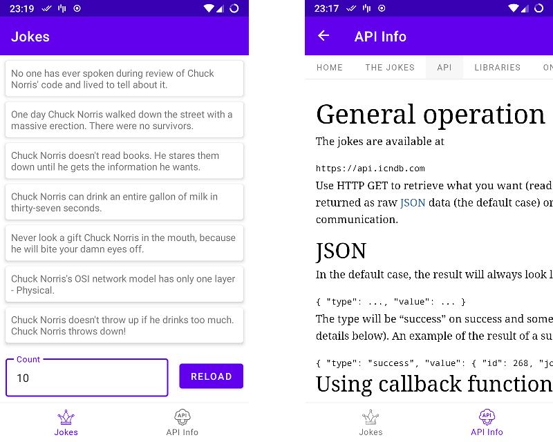

# Chuckles

A simple app for showing jokes about Chuck Norris.

## Frameworks and Libraries
* [Architecture components: Navigation, ViewModel and LiveData](https://developer.android.com/topic/libraries/architecture/)
* [AndroidX: Jetpack components](https://developer.android.com/jetpack/androidx/)
* [Coroutines: async processing](https://developer.android.com/kotlin/coroutines)
* [Retrofit2: REST client](https://square.github.io/retrofit/)
* [Moshi: Json Parsing](https://github.com/square/moshi)
* [Koin: Dependency Injection](https://insert-koin.io/)
* [mockK: mocking library](https://mockk.io/)

## License

Distributed under the MIT License. See `LICENSE` for more information.
